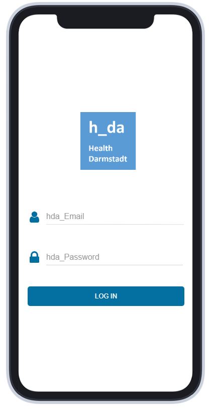
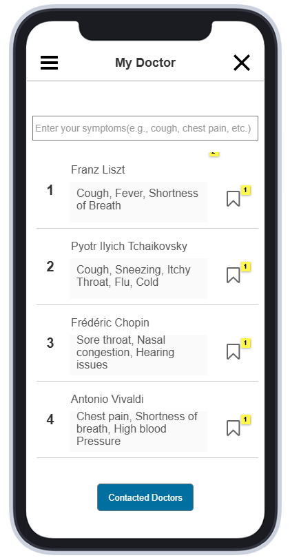
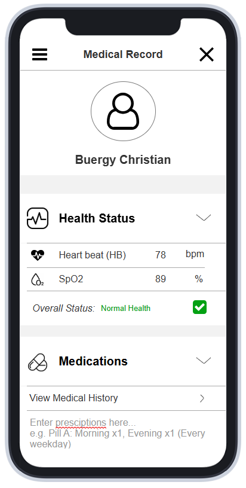

# Healthcare HMI App

This repository contains a Human-Machine Interface (HMI) healthcare application prototype created using [**Axure RP**](https://www.axure.com/). The application allows doctors and patients to interact through a simulated interface for managing health data, viewing prescriptions, and connecting with medical professionals.

# Table of Contents
- [Introduction](#introduction)
- [Key Features](#key-features)
- [Design Diagrams](#design-diagrams)
- [Use Case Scenarios](#use-case-scenarios)
- [Activity Diagram](#activity-diagram)
- [State Diagrams](#state-diagrams)
- [Design Considerations](#design-considerations)
- [Testing Considerations](#testing-considerations)
- [Proof of Concepts](#proof-of-concepts)

# Introduction
This project demonstrates a functional prototype for a healthcare app that showcases interactions between doctors and patients. It incorporates login/logout functionality, doctor search, connection management, viewing health information, and managing prescriptions.

# Key Features
- **Doctor-Patient Connection**: Allows patients to search and connect with available doctors.
- **Prescription Management**: Doctors can create and view prescriptions, while patients can view prescriptions issued to them.
- **Health Status Monitoring**: Doctors can view a patient's current health status metrics (heartbeat, SpO2).
- **Profile Management**: Both patients and doctors can view and manage their profile information.

# Design Diagrams
## Use Case Diagram
The use case diagram describes the various interactions between the user roles (Doctor, Patient) and the system. It outlines key functionalities like login, viewing profiles, connecting with doctors, and managing prescriptions.

---

## Activity Diagram
The activity diagram outlines the sequence of actions users follow in the application. Below is a sample section for UC04 and UC05:

[Click here to view the complete Activity Diagram](https://crjiw4.axshare.com/?code=c3eb832a63a4647d0b63e1e047577745&id=mv1nlc&p=activity_diagram&sc=3&g=1).

---

## State Diagrams
The following state diagrams represent system behavior for different user roles:
1. The patient’s state diagram illustrates transitions between states like login, menu navigation, doctor search, and viewing prescriptions.

2. The doctor’s state diagram shows state transitions for actions like viewing patients, creating prescriptions, and logging out.

---

## Design Considerations
| Use Case | Functionality in Mock-up | Interface | Feasible Interface(s) |
|----------|--------------------------|-----------|-----------------------|
| UC-01: Login to Account | User (Patient/Doctor) can enter Email and Password to login |  | text field, login button, Reapeater containing Email and Password, Axure's Filter Functions to filter out unmatch Email&Password in Repeater, If-else statment to determine if Email & Password are correct |
| UC-02: Logout of Account | User (Patient/Doctor) can click on the Logout button to logout of the Account |  | Logout button, Axure's Interaction go back to Login Page |
| UC-03: View Profile | User (Patient/Doctor) can click on the Profile sub-menu to view his/her Profile Infomation |  | Rectangle and Icon represent a sub-menu, Repeater containing information of certain Patient/Doctor ID, Axure's Filter |
| UC-04: Search Doctor | System displays list of available Doctors for Patient to choose | INT-01 | Repeater containng Doctor Name and Expertise |

[Click here to view the complete Design Considerations Diagram](https://crjiw4.axshare.com/?code=c3eb832a63a4647d0b63e1e047577745&id=rvz736&p=designconsiderations&sc=3&g=1).

---

## Testing Considerations
The test diagram describes various test scenarios implemented to ensure the app works as intended. These include login validation, prescription management, and data fetching tests.

[Click here to view the complete Test Diagram](https://crjiw4.axshare.com/?code=c3eb832a63a4647d0b63e1e047577745&id=dsyx7n&p=tests&sc=3&g=1).

---

# Proof of Concepts
- User interface with login features to access patient's perspective along with doctor searching functionality:

- Doctor's perspective with accessibility to patient's health status:

- A demo video showcasing the healthcare app functionality:
**[Watch Demo](figures/demo/HMI_demo.mp4)**

---
